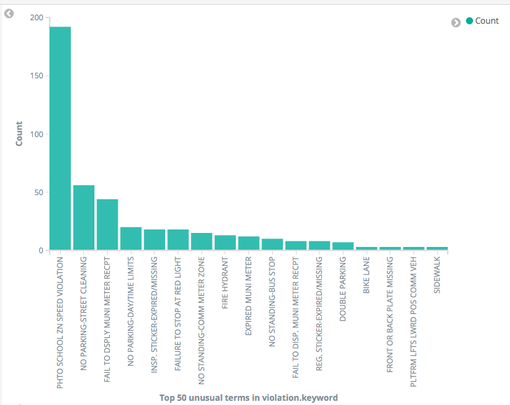
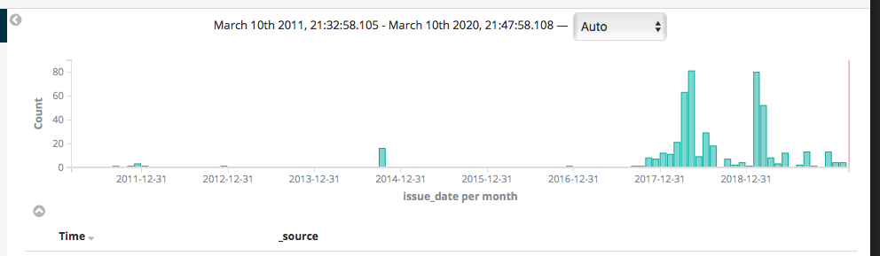
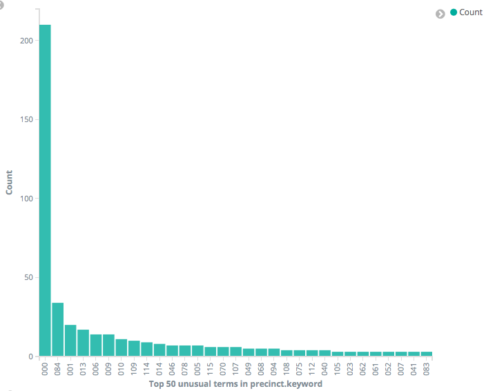
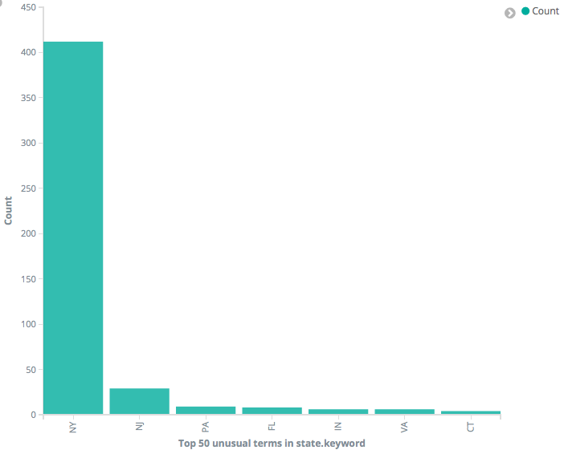

# NYOS
STA 9760 class project

I analyzed parking ticket data in New York City. [Parking ticket data](https://data.cityofnewyork.us/City-Government/Open-Parking-and-Camera-Violations/nc67-uf89) is publicly available from NYC Open Data and accessible through Socrata API. I used Docker and Python to create a shell script for importing data into an elastic search instance. The Docker container runs a Kibana instance for querying and visualizing the data from elastic search.

### Histogram for Types of Violations

Speeding in a school zone captured by a photo is the most common type of traffic offense in the sample. This is not surprising, since these violations are captured by photo.

### Time Histogram of Citations Per Month

Parking tickets are not distributed evenly in each month throughout the year.

### Tickets Issued by Precint

Precint code 000 has the most parking tickets by far, but this might represent photo-captured tickets instead of a location. Precints 084 (Downtown Brooklyn) and 001 (Manhattan Financial District) have high shares of tickets over the period analyzed. 

### Tickets Issued by License Plate State

Besides NY and NJ, PA, FL, IN, VA and CT are the top states where licenses got tickets mostly come from.
